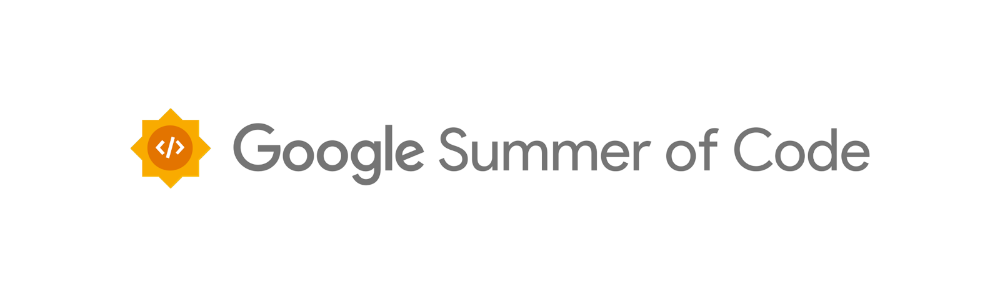

This blog post summarizes my open source experience, right from my very first open source contribution to getting selected for GSoC and completing my Google Summer of Code project!

{:width="100%"}

# About Me
I am <b>[Kishan Ved](https://github.com/Kishan-Ved)</b>, an undergraduate student at the Indian Institute of Technology Gandhinagar (IIT Gandhinagar), India, in the department of Computer Science and Engineering. I spent the summer after my second year doing my Google Summer of Code 2024 project with the NumFOCUS organization (which serves as an umbrella organization for open source projects), which had Open Science Labs as a sub organization. The project I worked on is: <b>[PyDataStructs](https://github.com/codezonediitj/pydatastructs)</b>.

# About PyDataStructs

<b>[PyDataStructs](https://github.com/codezonediitj/pydatastructs)</b> aims to be a Python package for various data structures in computer science. It also contains several algorithms including their parallel implementations. Everything is just a few calls away, and users don't need to write any code from scratch. The APIs provided are consistent with each other, clean and easy to use. All implementations are well tested, 99% lines of code have already been tested by developers. PyDataStructs is the first well-designed library/package which covers most of the data structures and algorithms, with different backends like Python and C++.

# My first contribution to open source
I began contributing to open source in December 2023, when I connected to a senior student at my university who had also done GSoC in 2023, with PyDataStructs. I was interested in the project that she did and hence I started exploring the codebase.

## Finding a good first issue
I went to the issues tab on the repository's github page and searched for good first issues. I noticed an issue that seemed doable: <b>[Implement Introsort](https://github.com/codezonediitj/pydatastructs/issues/545)</b>. This involved implementing the sorting algorithm: Introsort in the Python backend. I had learned this as a part of my academic cousework, and hence, I was able to code this.

## My first Pull Request
I started reading the README file and set up the repository locally and created the conda environment. Then I got to work. In a day, I was able to successfully create a PR (pull request) and open it on GitHub: <b>[Implemented Introsort](https://github.com/codezonediitj/pydatastructs/pull/549)</b>. This PR was reviewed and changes were requested. Once I had done all of them and all the CI checks passed, it was merged. And that's my first open souce contribution!

# Pre-GSoC Phase

Next, I connected to the maintainer, <b>[Gagandeep Singh](https://github.com/czgdp1807)</b>, and expressed my interest for contributing. He suggested that I contribute to more organizations, like: <b>[LFortran](https://github.com/lfortran/lfortran)</b> and <b>[LPython](https://github.com/lcompilers/lpython)</b> to maximize my chances for GSoC. These organizations also had Gagandeep Sir as the core maintainer and developer.

## The amazing open source community
I found the open source community amazing, everyone was ready to help me with every doubt I had, patiently guide me with differnt git commands to resolve conflicts and review my PRs and give valueable advice. I made new friends, who were almost of the same age as me, who had been contributing since quite a while. They made things easier for me and helped me contribute. 

## More open source contributions
I spent the next 3 months contributing to these organizations, and I had 10 merged PRs in the LFortran repository and 5 merged PRs in the LPython repository. Here's a link to these:

- <b>[LFortran contributions](https://github.com/lfortran/lfortran/pulls?q=is%3Apr+author%3AKishan-Ved+is%3Amerged)</b>

- <b>[LPython contributions](https://github.com/lcompilers/lpython/pulls?q=is%3Apr+author%3AKishan-Ved+is%3Amerged)</b>

These made me well versed with various git commands, the skill of handling a large and dynamic codebase and communicating effectively with the community to incorporate suggestions and solve issues.

## Drafting my GSoC proposal
Next, it was time to submit proposals for GSoC projects. By then, I had been contributing to open source for nearly 3 months. I requested a meeting with Gagandeep Sir to help me decide my proposal. He kindly agreed and we set up an online meeting, where we discussed potential GSoC ideas and the timeline that was best suited for me.

I submitted 2 proposals, to LPython (Python Software Foundation) and PyDataStructs (NumFOCUS):

- <b>[NumFOCUS - Open Science Labs: PyDataStructs: Add C++ Backend for all trees](https://drive.google.com/file/d/1khpreH4pVJSj26VGJOf2v_XDCrOlo8qP/view?usp=sharing)</b>

- <b>[Python Software Foundation - LPython: Implement modules from the Python Standard Library](https://drive.google.com/file/d/1to69uW9rb9vAE6pJCooamQo-Q1f_BYBt/view?usp=sharing)</b>

The proposals should have personal information, details about previous open source contributions made to the organization's repository, and detailed information about the project that you wish to take up, with a structured plan about your goals. In addition to this, it must contain an expected timeline that you will follow. It's a good practice to set a large number of small goals and plan tasks before starting the project.

## Continuing open source contributions
It's a good practice to remain active in the organizations by contributing even after submitting GSoC proposals, this makes the developers believe that you are genuinely interested in the project and enthusiastic to contribute. This amplifies chances for getting selected for Google Summer of Code!

# GSoC Phase
I got my acceptance letter at 11:32 pm IST on May 1, 2024. It was 2 minutes past the result declaration time and I was at the edge of my seat. I was overjoyed to get the mail saying I was accepted as a Google Summer of Code contributor for NumFOCUS! Here's my project: **[Open Science Labs: PyDataStructs: Add a C++ Backend for tree data structures and their algorithms](https://summerofcode.withgoogle.com/programs/2024/projects/2nrxEFTg)**

## My GSoC project goals

My project involved adding a C++ backend for all tree data structures in **[PyDataStructs](https://github.com/codezonediitj/pydatastructs)**, a Python package for advanced data structures and algorithms. The user has an option to select either the Python backend or the C++ backend.


```python
tree = RedBlackTree(backend=Backend.CPP)
```


For any data structure, the Python backend is developed first, and once completely tested and ready, its C++ backend is developed. Both the backends share full functionality and are completely compatible. The C++ backend is extremely fast, it executes codes 8-10 times faster. This enhances the computation speed, making it extremely valuable for scientific computing and high-performance applications.

## The community bonding period
I'll be honest, it was difficult at the start. I found the project a little more difficult than I had anticipated, and realized that it demanded a little more that my current skillset. My mentor, Gagandeep Sir, adviced me to read the documentation and first learn about Python-C API, which was something totally new for me. I spent the first week doing this, and I could barely write any code. However, I soon realized the importance of reading the documentation and how smoothly things went following that. Within a week, I became well versed with all the new technology and started coding up my first PR. 

## Coding phase

I started working from the community bonding period itself, and this gave me a good headstart and allowed me to complete the project in 12 weeks. Here's an outline of all the work I did:

### Pre GSoC Work

| PR Description | Contribution |
|------------------|--------------|
| [PR: Added Introsort algorithm](https://github.com/codezonediitj/pydatastructs/pull/549) | **<span style="color: green;">+127</span>** |
| [PR: Fixed version related bugs](https://github.com/codezonediitj/pydatastructs/pull/553) | **<span style="color: green;">+4</span>** |

### Community bonding period

| PR Description | Contribution |
|------------------|--------------|
| [PR: C++ backend for Node, TreeNode, ArrayForTrees, BinaryTree and BinarySearchTree and all tree traversals implemented](https://github.com/codezonediitj/pydatastructs/pull/556) | **<span style="color: green;">+1,936</span>** |

### Coding Phase 1

| PR Description | Contribution |
|------------------|--------------|
| [PR: C++ backend for Self Balancing Binary Tree](https://github.com/codezonediitj/pydatastructs/pull/559) | **<span style="color: green;">+328</span>** |
| [PR: C++ backend for Red Black Trees](https://github.com/codezonediitj/pydatastructs/pull/560) | **<span style="color: green;">+748</span>** |
| [PR: C++ backend for Binary Indexed Trees](https://github.com/codezonediitj/pydatastructs/pull/561) | **<span style="color: green;">+179</span>** |
| [PR: C++ backend for Splay Trees](https://github.com/codezonediitj/pydatastructs/pull/562) | **<span style="color: green;">+423</span>** |

### Coding Phase 2

| PR Description | Contribution |
|------------------|--------------|
| [PR: C++ backend for AVL Trees](https://github.com/codezonediitj/pydatastructs/pull/564) | **<span style="color: green;">+488</span>** |
| [PR: C++ backend for Cartesian Trees](https://github.com/codezonediitj/pydatastructs/pull/567) | **<span style="color: green;">+254</span>** |
| [PR: C++ backend for Treap](https://github.com/codezonediitj/pydatastructs/pull/568) | **<span style="color: green;">+150</span>** |
| [PR: C++ backend for all trees in `binary_trees.py` file complete](https://github.com/codezonediitj/pydatastructs/pull/569) | **<span style="color: green;">+72</span>** |
| [PR: Updated Documentation](https://github.com/codezonediitj/pydatastructs/pull/570) | **<span style="color: green;">+12</span>** |

---

## Contribution Stats:

Lines added: **<span style="color: green;">+4,721</span>** (#2 contributor in terms of lines added)

Commits made: 12

Total merged Pull Requests : 12

Here's a complete list of all my **[merged PRs](https://github.com/codezonediitj/pydatastructs/pulls?q=is%3Apr+is%3Amerged+author%3AKishan-Ved)**

## Speed results

Time taken for methods of Binary Search Tree class to execute in different backends:
<p align="center">
  
</p>
  
The picture clearly indicates the utility of the C++ backend. It makes code execution much faster. This is helpful for high-performance computing.


## Weekly reports

My Google Summer of Code blogs are available on my website: **[https://kishan-ved.github.io/portfolio/blog/](https://kishan-ved.github.io/portfolio/blog/)**

## Final Report

My final report for Google Summer of Code 2024 is available here: **[Google Summer of Code 2024 Report](https://gist.github.com/Kishan-Ved/ebe0a971220d67517ae815e4f92d2459)**

## Future work

My project is complete, the C++ backend for all trees is fully functional. Some (non-critical) issues have been opened, these need to be addressed. For upcoming plans (and major goals), refer **[PyDataStructs Wiki](https://github.com/codezonediitj/pydatastructs/wiki/Google-Summer-of-Code-Project-Ideas)** on GitHub.

## Learnings

**Tech**: Mastered the art of linking a Python code to a C++ backend by using the Python-C API to improve speeds greatly. Polished my C++ and Python coding skills.

**GitHub**: Learned various new commands, resolution of conflicts and merging branches for collaborative work.

**Perseverance**: GSoC taught me to read the documentation, be calm and perseverant. It's difficult at the start but smoother ahead!

---

And that's my entire open source story, from my first contribution to getting selected for Google Summer of Code! I hope this helps you to navigate through the amazing world of open source software!

Thanks to my mentor **[Gagandeep Singh](https://github.com/czgdp1807)** for his support and guidance. Thanks to **[Ivan Ogasawara](https://github.com/xmnlab)** and the team at Open Science Labs and NumFOCUS.